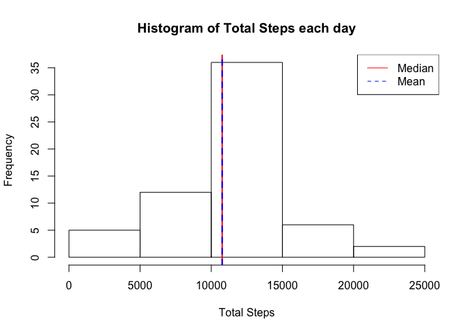

# Reproducible Research: Peer Assessment 1


## Loading and preprocessing the data


```r
library(dplyr)
```

```
## 
## Attaching package: 'dplyr'
```

```
## The following objects are masked from 'package:stats':
## 
##     filter, lag
```

```
## The following objects are masked from 'package:base':
## 
##     intersect, setdiff, setequal, union
```

```r
data <- tbl_df(read.csv(unz("activity.zip","activity.csv")))
#change date column type to Date
data$date <- as.Date(data$date)
```

## What is mean total number of steps taken per day?


```r
#Group and summarise data, calculating total steps per day
hData <- data %>% group_by(date) %>% summarise(totalSteps = sum(steps))
hist(hData$totalSteps, main = "Histogram of Total Steps each day", 
     xlab = "Total Steps")
abline(v = mean(hData$totalSteps, na.rm = TRUE), col = "red", lwd = 2)
abline(v = median(hData$totalSteps, na.rm = TRUE), 
       lty = 2, col = "blue", lwd = 2)
legend("topright",legend = c("Median", "Mean"), col = c("red","blue"), lty = c(1,2))
```


## What is the average daily activity pattern?


```r
#Group and summarise data calculating average per interval over all days
pData <- data %>% group_by(interval) %>% 
        summarise(avgSteps = mean(steps, na.rm = TRUE))
with(pData, plot(interval, type ="l", avgSteps, ylab = "Average Steps/Day"))
maxSteps <- max(pData$avgSteps, na.rm = TRUE)
maxInterval <- pData[pData$avgSteps == maxSteps,]$interval 
abline(v = maxInterval, col = "red")
```


The 835 interval contains the maximum number of steps (206.1698113) on average over all days.

## Imputing missing values

There are 2304 incomplete rows of data.


```r
#Replace NAs with the median for that interval over all days
iData <- data %>% 
        mutate(
                steps = ifelse(is.na(steps), 
                               pData[match(interval,pData$interval), ]$avgSteps
                               , steps))
hIData <- iData %>% group_by(date) %>% summarise(totalSteps = sum(steps))
hist(hIData$totalSteps, main = "Histogram of Total Steps each day", 
     xlab = "Total Steps")
abline(v = mean(hIData$totalSteps, na.rm = TRUE), col = "red", lwd = 2)
abline(v = median(hIData$totalSteps, na.rm = TRUE), 
       lty = 2, col = "blue", lwd = 2)
legend("topright",legend = c("Median", "Mean"), col = c("red","blue"), 
       lty = c(1,2))
```



There is no impact on imputing missing values.

## Are there differences in activity patterns between weekdays and weekends?


```r
library(ggplot2)
#Add factor column for day type, group and summarise mean steps
days = c("Monday","Tuesday", "Wednesday", 
         "Thursday", "Friday","Saturday","Sunday")
aPData <- iData %>% 
        mutate(
                day = 
                        ifelse(weekdays(date) %in% days[1:5],
                               "weekday", "weekend")) %>% 
        mutate(day = as.factor(day)) %>%
        group_by(interval, day) %>%
        summarise(avgSteps = mean(steps))
print(qplot(interval, avgSteps, data = aPData, facets = day ~ ., geom = "line"))
```


